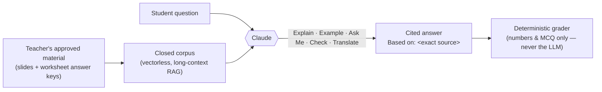

<div align="center">

# Verity AI

### One truth: your teacher's material, in every student's language.

**A closed-corpus AI learning platform for ESL students at IB & Cambridge international schools.**
Every answer comes only from a teacher's own approved material — never the open internet — cited every time, and translated into a student's own language.

[](https://esltech.vercel.app)
[](./LICENSE)
[](https://nextjs.org)
[](https://anthropic.com)

**[Live Demo →](https://esltech.vercel.app)** &nbsp;·&nbsp; **[Pitch Deck →](./docs/Verity-AI-Pitch-Deck.pptx)** &nbsp;·&nbsp; **[Demo Script →](./DEMO.md)**

Built end-to-end for the **Claude Code Hackathon**

</div>

---

## Why Verity AI

Generic AI tutors answer from the whole internet — unpredictable, uncited, and easy for a student to use to just cheat. **Verity AI does the opposite**: it is architecturally constrained to answer *only* from material a teacher has approved, cites the exact source every time, and is designed to guide a student toward an answer rather than hand one over.

| | |
|---|---|
| 🔒 **Closed-corpus, cited** | Every answer traces to an exact slide or worksheet — no open-internet knowledge, no hallucinated sources. |
| 🌏 **Multilingual by design** | Explains and translates into a student's own language — Chinese (Mandarin, Simplified) live today, Korean/Malay/Tamil next. |
| 🎯 **Guides, never cheats** | The tutor hints and asks Socratic questions — it will not complete a student's assignment for them. |
| ✅ **Trusted grading** | Numbers and multiple-choice are graded by deterministic, unit-tested code — never by an LLM guessing. |
| 📈 **Adaptive & transparent** | Difficulty adapts to the learner; every AI conversation is fully visible to the teacher. |

## Contents
- [How it works](#how-it-works)
- [What's live today](#whats-live-today)
- [Architecture](#architecture)
- [Tech stack](#tech-stack)
- [Quick start](#quick-start)
- [Testing](#testing)
- [Roadmap](#roadmap)
- [Team](#team)

## How it works



A student never has to write a prompt — they tap one of five intents (**Explain**, **Give Example**, **Ask Me Questions**, **Check My Answer**, **Translate**), and the system prompt architecturally forbids the model from using anything outside the approved corpus or completing an assignment on the student's behalf.

## What's live today

**Two complete Physics topics**, built from the school's real Grade 7 teaching material (not synthetic content):

- **Moments of a Force** — interactive drag-to-balance seesaw simulation, moment/torque worked examples.
- **Distance–Time Graphs** — a scrubbable journey graph syncing a moving figure to a live distance-time plot.

Each topic ships with the full 5-mode AI Tutor, a deterministic auto-grading Practice Zone (unit-tested), and an ESL Reading Assistant (inline glossary + text-to-speech, bilingual English/Chinese).

**Four role-based views**, matching how a real school is structured:

| Role | View |
|---|---|
| 🎒 Student | The AI Tutor, interactive visuals, and adaptive practice |
| 👩‍🏫 Teacher | Full AI-chat transparency, reliance flags, class progress |
| 📊 HOD | Department-level rollup across sections and teachers |
| 🏫 Principal | School-wide completion, engagement, and ESL-improvement dashboards |

> **Honest note on data:** the AI tutor, grading, and translation are fully live and functional. The Teacher/HOD/Principal dashboards currently run on realistic, clearly-labeled illustrative data — real authentication and persistence (Supabase) is the next build phase, not yet wired up in the hackathon window.

## Architecture

- **Retrieval is hybrid by design.** A small per-topic corpus is injected directly into Claude's context as vectorless, long-context RAG — no embedding drift, maximum accuracy at classroom scale. The architecture is designed to graduate to pgvector for whole-school libraries, and a curriculum knowledge graph later, for adaptive learning paths.
- **Accuracy is deterministic wherever it can be.** Numbers and MCQs are graded by rule-based code in [`src/lib/grade.ts`](./src/lib/grade.ts) — unit-tested, never left to an LLM to "guess" a grade. The LLM is reserved for what LLMs are actually good at: explanation, Socratic questioning, translation, and rubric-based feedback.
- **Academic integrity is enforced in the system prompt itself** ([`src/lib/tutor.ts`](./src/lib/tutor.ts)) — the tutor is architecturally forbidden from completing an assignment, and always cites its source.
- **Translation is corpus-grounded, not generic MT.** Every Chinese translation ties back to the exact approved-material chunk it came from ([`src/data/translations-zh.ts`](./src/data/translations-zh.ts)), reviewed for terminology consistency.

## Tech stack

Next.js 16 (App Router) · TypeScript · Tailwind CSS v4 · Framer Motion · Anthropic Claude API · Vitest · Supabase (auth/roles/storage/pgvector — planned) · Deployed on Vercel

## Quick start

```bash
npm install
cp .env.local.example .env.local   # add ANTHROPIC_API_KEY for the live tutor
npm run dev                        # http://localhost:3000
```

Without an API key the app runs in **demo mode** with curated, still-cited fallback responses, so the whole flow is clickable end-to-end.

## Testing

```bash
npx vitest run    # deterministic grader — value, unit, direction, tolerance
```

## Roadmap

Teacher material upload with auto-question generation · real Supabase authentication & persistence · Korean, Malay, and Tamil language packs · additional subjects beyond Physics · whole-school vector + graph RAG · native iPad app.

## Team

**Founder & Builder** — 20+ years in enterprise banking technology at global financial institutions, building systems that must be correct, auditable, and trusted at scale. Currently founder of [Dhari AI](https://dhari.ai), building production-grade reasoning agents for regulated institutions with banking-grade rigor — the same discipline applied here to ESL education.

## License

[MIT](./LICENSE) — see the license file for details.
