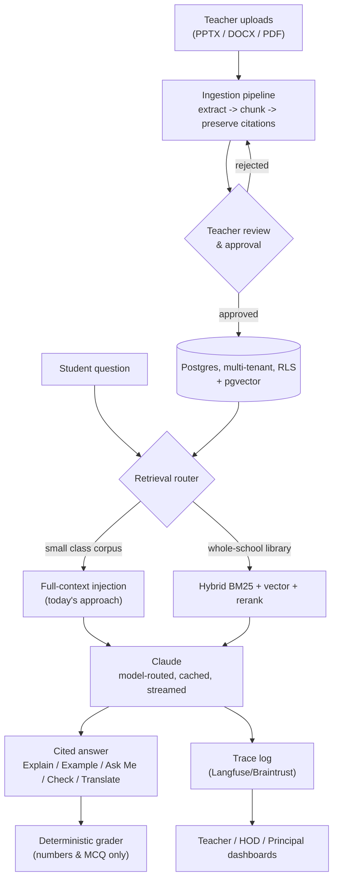

# Verity AI — Roadmap & Architecture Spec

**Status:** Post-hackathon review. Captures the honest state of the hackathon build, the target architecture for a multi-school product, and the phased plan to get there.

**Audience:** engineering (this repo's next contributors), and anyone evaluating what it takes to move Verity AI from hackathon demo to a product international schools can actually buy and run.

---

## 1. Honest assessment of the hackathon build

### What's genuinely production-worthy — keep and build on
- **The core product thesis and prompt architecture** — closed-corpus, citation-forced, guidance-only (`src/lib/tutor.ts`). This was adversarially tested across several rounds of real bugs and got structurally better each time; it is validated design, not just code.
- **The deterministic grader** (`src/lib/grade.ts`) — unit-tested, correct philosophy (never let an LLM grade a number), extensible to new question types.
- **The conversational state machine** — turn tracking, context-chunk gating for "Check My Answer," intent-continuation on Enter. Hard-won correctness from real bug-fixing this hackathon; worth preserving as-is.
- **The UI design language** — premium, coherent, dark glassmorphic theme, iPad-appropriate.

### What's demo scaffolding and must be replaced, not extended
- **Corpus, translations, and practice banks are hardcoded TypeScript files** (`src/data/corpus.ts`, `translations-zh.ts`, `practice-banks.ts`). Fine for 2 topics; impossible at the scale of a real school's full curriculum. The whole content layer needs to move to a database with a real ingestion pipeline.
- **No authentication, no persistence.** Teacher/HOD/Principal dashboards run on illustrative mock data (`src/data/monitoring.ts`, `department.ts`). Every visitor shares the same anonymous session.
- **No streaming.** The tutor waits for the full Claude response before showing anything — at ~800 tokens that's a 5–15s frozen screen. Real students will assume it's broken.
- **A real security gap:** once live AI Gateway credentials are set, `/api/tutor` and `/api/translate` become open, unauthenticated endpoints anyone on the internet can call. **This must close before the key ever goes into a real deployment** — see [Phase 0](#phase-0--harden-the-foundation).
- **Single-tenant by construction.** One school, one corpus, no isolation between classes or schools.

**Verdict:** this is a validated prototype with a proven interaction model, not a false start. The plan below keeps the "brain" (prompting, grading, state machine, design system) and rebuilds the "body" (data, auth, content pipeline) underneath it. This is deliberately **not** a rewrite.

---

## 2. Target architecture



**The single most important new component is the ingestion pipeline.** Everything the hackathon hardcoded by hand (source material was manually transcribed from real school PPTs and worksheets) must become self-serve: teacher uploads → automated extraction → AI-assisted chunking with page/slide provenance preserved → **teacher approves before it enters the corpus**. That approval step is the quality moat — it keeps "closed-corpus" honest at scale, and it's the direct institutional version of the same manual accuracy-checking that happened repeatedly during the hackathon.

**Retrieval stays hybrid by design**, matching the original architecture decision:
- Per-class corpora stay full-context / vectorless (most accurate, zero embedding drift) — the approach already built.
- Whole-school libraries graduate to pgvector + keyword hybrid + reranking once a corpus exceeds what fits in context.
- A curriculum knowledge graph (prerequisite mapping → adaptive learning paths) comes later, once there's real usage data to shape it from — don't build this speculatively.

### Sketch data model

```
schools            (id, name, tenant_key, region, plan_tier)
users               (id, school_id, role[student|teacher|hod|principal], sso_subject)
classes             (id, school_id, subject, grade, teacher_id)
corpus_documents     (id, class_id, uploaded_by, source_file, status[pending|approved|rejected])
corpus_chunks        (id, document_id, heading, text, citation, embedding, approved_by, approved_at)
conversations        (id, student_id, class_id, topic_id, started_at)
conversation_turns   (id, conversation_id, role, intent, text, cited_chunk_ids, created_at)
practice_attempts    (id, student_id, question_id, answer, graded_result, graded_by[rule|llm])
events               (id, user_id, type, payload, created_at)   -- powers all dashboards
```

`events` is the single append-only stream that both the Teacher-transparency view and the eval/observability tooling read from — one source of truth for "what happened," not separate ad hoc tracking per dashboard.

---

## 3. Tech stack recommendation

| Layer | Recommendation | Why / trade-off |
|---|---|---|
| Frontend | **Keep Next.js + Vercel** | No reason to move. Add `next-intl` (UI strings are hardcoded English today), streaming responses, and proper client state (Zustand/React Query) as the tutor panel grows more stateful. |
| Database | **Postgres with Row-Level Security** (Supabase or Neon) | RLS gives per-school tenant isolation at the database layer — the safest multi-tenancy model for a small team. Supabase bundles auth + storage + pgvector; Neon if best-of-breed pieces are preferred separately. |
| Auth | **School SSO first-class**: Google Workspace for Education + Microsoft Entra ID, via Supabase Auth or Clerk | International schools live on Google/Microsoft. Password accounts for minors are both an anti-pattern and a compliance burden. |
| File storage | Supabase Storage / S3 | Teacher uploads, per-tenant buckets. |
| AI | **Claude via API**, model-routed, prompt-cached | Same provider as today; add a thin routing abstraction to A/B models per task (Opus for tutoring quality, Sonnet for generation, Haiku for classification). |
| LLM observability | **Langfuse or Braintrust** | Trace every tutor conversation. This doubles as the data source for Teacher AI-transparency — one system serves both compliance and product. |
| Evals | **Golden-set eval harness in CI** | Citation fidelity, out-of-corpus refusal, academic-integrity (never gives the final answer), translation terminology consistency. Runs on every PR — this is the "accuracy is utmost" discipline, automated instead of manually re-litigated every round. |
| Errors / analytics | Sentry + PostHog | Standard, low-risk choices. |
| Background jobs | Vercel Workflows / Inngest / Trigger.dev | Ingestion and question-generation are long-running — they cannot live inside request handlers. |

**Deliberately not adopted yet:** microservices, Kubernetes, a separate Python ML service, GraphQL, a native mobile app. A modular Next.js monolith on managed infrastructure is correct until well past the first 10 schools.

---

## 4. Non-negotiables for selling to top international schools

These are product requirements in the buyer's eyes, not internal checkboxes:

1. **Student-data compliance** — PDPA (Singapore) and GDPR (many international schools follow it regardless of physical location), plus minors-specific consent flows. Data-residency choice (SG/EU) matters to school boards. The founder's Dhari AI positioning (MAS FEAT, PDPA, GDPR rigor) is a direct, genuine credibility asset here — same discipline, same story.
2. **A written AI-use policy pack for schools** — what the AI can and cannot do, what's logged, what parents can see. Schools buy the governance document nearly as much as the software.
3. **Accessibility (WCAG 2.2 AA)** — required in most international-school procurement processes, and simply the right thing for a product serving language learners.
4. **Content IP protection** — teacher materials are copyrighted (Cambridge textbooks especially). Per-tenant isolation and a clear, contractual "your content never trains models, never leaves your tenant" stance.
5. **Human-in-the-loop everywhere AI generates content** — translations, generated questions, chunked material: a teacher approves before students see it. This turns a hackathon lesson (translation errors that were caught and fixed by hand, repeatedly) into a durable institutional workflow instead of a one-off fix.

---

## 5. Phased roadmap

### Phase 0 — Harden the foundation (2–3 weeks)
- Close the open-API-route security gap (auth gate + rate limiting) **before** any live key goes into a real deployment.
- Add streaming to the AI Learning Assistant responses.
- Extract UI strings to `next-intl` (currently hardcoded English).
- Move corpus / translations / practice banks from static TS files into Postgres behind a repository layer — app behavior unchanged, storage swapped.
- Stand up CI (build + vitest + lint on every PR, branch protection), Sentry, Langfuse, and a staging environment.

### Phase 1 — Pilot-ready product (4–6 weeks)
- Real authentication with Google/Microsoft SSO + role-based access.
- The **teacher ingestion pipeline**: upload → extract → chunk → review → approve.
- Real student event capture feeding the Teacher dashboard (replacing mock data in `monitoring.ts`/`department.ts`).
- AI question generation with mandatory teacher approval before publishing.
- The eval harness, seeded with a golden set built from the real Grade 7 corpus already in this repo.

### Phase 2 — Run a real pilot (one term, 1–2 schools)
- One school, 2–4 classes, weekly teacher feedback loop.
- Instrument everything; agree success metrics up front — weekly active students, teacher time saved, vocabulary/score movement, AI-reliance flags trending down over the term.
- This phase produces the case study — the sales asset that matters more than any single feature.

### Phase 3 — Scale the content and language engine (parallel with pilot learnings)
- Korean, Malay, Tamil language packs — glossary-tuned and **native-speaker reviewed** (budget for human reviewers; this is now a process, not a file to hand-edit).
- Additional subjects beyond Physics.
- Hybrid vector retrieval as corpora grow past single-class scale.
- Adaptive difficulty driven by real performance data.
- A parent-visibility view.

### Phase 4 — Enterprise readiness (as sales demand it, not before)
- Multi-school admin and district/group rollups.
- SOC 2 Type I, then Type II.
- SLAs, data-residency options, formal procurement documentation.
- Per-student billing integration.

---

## 6. Immediate next steps, in order

1. **Decide the pilot school** — everything else sequences off a real launch date with a real teacher.
2. **Turn Section 5 into tracked engineering issues** — one issue per bullet, Phase 0 first.
3. **Fix the API security gap** — the first engineering task, before anything else ships or gets a live key.
4. **Stand up Supabase (or Neon) + CI + staging** — the infrastructure week that makes everything after it fast.
5. **Build the ingestion pipeline MVP** — the one feature that transforms this from "demo with the founder's own content" into "a platform for any teacher's content."
6. **Stand up the eval harness** — so every future change to prompts or models is tested against citation fidelity and academic integrity automatically, the way it was manually tested during the hackathon.
7. **Then**: SSO, real dashboards, and pilot onboarding.

---

## 7. Environments

- **Production** — `main` branch, auto-deployed by Vercel's GitHub integration to `esltech.vercel.app` on every push.
- **Staging** — `staging` branch, auto-deployed by the same integration to its own Vercel-assigned preview URL. Workflow: land feature work on `staging` first, verify there, then merge `staging` → `main` to release.
- **CI gate** — every push/PR to `main` runs `.github/workflows/ci.yml` (lint, build, vitest). Branch protection on `main` requires the `build-and-test` check and blocks force-pushes/deletions; repo admins remain able to push directly (`enforce_admins: false`) since there's no second engineer yet to review PRs.

**Resolved (Phase 2):** `AI_GATEWAY_API_KEY`, Supabase credentials, and OAuth providers are now live in production — see the Phase 2 section below.

**Model-agnostic by design:** the AI layer (`src/lib/ai.ts`) routes through the Vercel AI Gateway using plain `"provider/model"` strings via the `ai` SDK — switching from Claude to GPT, Gemini, DeepSeek, Qwen, Kimi, etc. is an `AI_MODEL` env var change, not a code change (see `.env.local.example`).

**Incident — first live model call failed silently:** the original hardcoded default (`anthropic/claude-opus-4.8`) is restricted on Vercel's free Hobby-tier AI Gateway ("Free tier users do not have access to this model"), and the tutor route's `streamText` swallowed this as an empty stream with no error — a false "success" showing nothing to the student. Fixed by (1) defaulting `MODEL` to `anthropic/claude-sonnet-5`, the strongest tier reasonably likely to be free-tier accessible; (2) adding a `GATEWAY_FALLBACK_MODELS` chain (`claude-haiku-4.5` → `gpt-5.4-mini` → `llama-3.3-70b`) via `providerOptions.gateway.models` at every call site, so a future plan-tier restriction degrades gracefully instead of failing every request; (3) the tutor route now tracks `receivedAnyText` and surfaces a real error message if the stream completes empty, instead of silently reporting done. `AI_MODEL`/`AI_TRANSLATE_MODEL` env vars still override the default at any time.

**Observability — wired but dormant:** Sentry (`src/instrumentation.ts`, `src/instrumentation-client.ts`) and Langfuse (traces every `/api/tutor` and `/api/translate` call via `experimental_telemetry`) are both fully wired but gated on env vars (`SENTRY_DSN`/`NEXT_PUBLIC_SENTRY_DSN`, `LANGFUSE_PUBLIC_KEY`/`LANGFUSE_SECRET_KEY`) that aren't set yet — true no-ops today, live the moment real keys are added to Vercel, no further code changes needed.

**Phase 1/2 — Auth now live:** Supabase Auth (Google/Microsoft SSO via `src/app/login`, `src/app/auth/callback`, `src/app/auth/signout`) and role gating on `/teacher`, `/hod`, `/principal` (`src/lib/auth.ts`'s `requireRole()`) are wired against a real Supabase project (Singapore region, for PDPA data residency) with both Google and Microsoft OAuth apps registered and configured. First-time sign-in provisions a `public.users` row whose role comes from the `staff_allowlist` table (migration `0005`, keyed by email): a pre-approved teacher/hod/principal email gets that role automatically at login and is re-synced on each subsequent login; everyone else defaults to `role='student'` (least privilege). `staff_allowlist` is service-role-only (RLS on, no policy) and is the seam a future "invite teacher" admin UI writes to — it replaces the manual per-teacher SQL promotion the pilot began with. A non-allowlisted user's role is never auto-downgraded, so a deliberately hand-set role still sticks. `/subjects` and the topic pages (student-facing) are deliberately left ungated in this pass — requiring student login raises its own questions (minors, parental consent, Google Workspace for Education provisioning) that deserve their own scoped task rather than being folded in silently here.

**Phase 1 — Event capture, narrower than planned:** `practice_attempts` (via `POST /api/practice/attempt`, fire-and-forget from `PracticeZone.tsx`) and generic `events` (via `src/lib/events.ts`, called from `/api/tutor`) both log real rows the moment a signed-in student exists — no further code changes needed. **`conversations`/`conversation_turns` (the detailed per-message chat transcript that feeds the Teacher AI-transparency view) are NOT wired up** — the schema requires a real `class_id`, and nothing in the app creates `classes` rows yet (no teacher class-creation flow exists). Until that exists, per-student chat transcripts have no real class to attach to. The Teacher/HOD/Principal dashboards (`src/data/monitoring.ts`, `src/data/department.ts`) therefore **still show mock data** — swapping them for real queries is blocked on both student auth (deferred above) and class/roster creation (not yet scoped anywhere), not just on Supabase being configured.

**Phase 1 — Closed-corpus eval harness:** `evals/golden-set.ts` + `evals/eval.test.ts` — a small set of real-model test cases (citation fidelity against actual corpus sources, out-of-corpus refusal, academic-integrity/never-gives-the-final-answer) run through the real `/api/tutor` route handler directly, not a duplicated prompt-construction path. Assertions are mechanical (does the reply cite a real source string, does it contain the exact known final answer) rather than semantic, since that's what a regex can check reliably. Runs as part of `npx vitest run` (already in CI) via `describe.skipIf(!hasApiKey())` — shows as **skipped, not failed,** without `AI_GATEWAY_API_KEY`, and `.github/workflows/ci.yml`'s Test step already passes through `secrets.AI_GATEWAY_API_KEY` if one exists, so adding that one repo secret is the only step needed to activate it for real. Each run costs real model tokens once active — small golden set by design to keep that cost bounded.

**Phase 1 — Teacher content-ingestion pipeline:** upload (`/teacher/ingest`) → extract → AI-assisted chunk → save pending → **pause and wait for teacher approval** → finalize, built on [Vercel Workflow DevKit](https://useworkflow.dev) (`src/workflows/ingest-document.ts`). The pause step uses `createHook()` — the workflow genuinely suspends (zero cost) until the teacher clicks Approve/Reject, which calls `resumeHook()` from `POST /api/ingest/review`. Same dormant pattern as everything else: inert without Supabase configured, and additionally needs `AI_GATEWAY_API_KEY` for the chunking step (falls back to nothing — there's no demo-mode path for ingestion, unlike the tutor).

- **Format support (Phase 2):** `.docx` (via `mammoth`), `.pdf` (via `unpdf`), `.pptx` (unzip via `fflate` + pull text from each slide's `<a:t>` runs — lightweight, no OCR engine), and `.txt`. PPTX matters because the school's real source material *is* PPTX (see `src/data/corpus.ts`); the earlier `officeparser` rejection (it bundles `tesseract.js`) still stands, but that reasoning only applied to OCR — plain slide-text extraction needs no such dependency. A teacher can **select multiple files at once**; each becomes its own document, all applied to the same section(s) chosen for that upload. **Video is deliberately out** — it has no extractable text without a speech-to-text pipeline (transcription cost, large-file storage vs the 20 MB cap, timestamp-based citations), which is its own scoped task, not folded in here.
- **Course/section model (migration `0004_courses_sections.sql`, Phase 2):** the original `classes` table conflated a course (Grade 7 Physics) with a section (7A). It's now split: `courses` = `(school, subject, grade, academic_year)`; `classes` = a *section* `(course, section_name)` owned by one teacher. `src/lib/ingestion/class.ts`'s `resolveTeacherSections()` auto-provisions the course and the uploader's section(s) on upload (still no class-management UI — same auto-provision spirit as `DEFAULT_SCHOOL_ID`), keyed on `(course, section_name)` so a teacher's Physics-7A and Physics-7B no longer merge, and a second subject no longer merges into the first. A section owned by a *different* teacher is never reused (rejected with a clear 409) — **teacher-scoped sharing only**; cross-teacher/department-shared corpora are a deliberate future extension (HODs already have the elevated read access that would anchor it). One upload can apply to several of the uploader's own sections at once (comma-separated section field → `corpus_document_sections` join), so "same material for 7A and 7B" is one upload, "different material" is two. `academic_year` defaults from the server date (Aug rollover for the IB/IG calendar) but is editable per upload. **Also fixed here:** `practice_attempts`/`events` RLS previously let *any* teacher read *every* student school-wide; a teacher is now scoped to students enrolled in a section they teach (via `class_enrollments`), HOD/principal keep the school-wide view. **Upload size cap** of 20 MB now enforced in the upload route.
- **Review UI is intentionally minimal** (`src/components/teacher/IngestPanel.tsx`): a form, a manual refresh button, and per-document approve/reject — no polling, no progress bar, no editing chunks before approval.
- **Not tested against live infrastructure or with `@workflow/vitest`** — the latter's own docs state `vi.mock()` doesn't work in its integration tests (step dependencies are bundled by esbuild), and every step here calls out to Supabase or the AI Gateway, neither of which exist yet to test against for real. Verified only at the code/build level: `next build` correctly compiles the workflow (1 workflow, multiple steps detected), and the dormant path (`hasSupabase()` false) returns a 503/clear message from every route with zero effect on the rest of the app.

**Phase 1 — AI question generation with teacher approval:** reuses the exact same `createHook()` pause-for-approval pattern from the ingestion pipeline, one level deeper — `src/workflows/generate-questions.ts` generates one Easy/Medium/Challenge question per **approved** corpus chunk, saves them `pending`, suspends, and only writes `status='approved'` once the teacher checks which ones to keep via the new per-chunk review UI in `/teacher/ingest` (`src/components/teacher/ChunkQuestions.tsx`). Generated questions are typed as `lib/grade.ts`'s exact `Question` union (numeric | mcq), so an approved row needs no translation step to be graded by the existing deterministic grader — never an LLM guess, same discipline as everything else "grading" in this app.

- **Approved rows are not yet wired into the student-facing Practice Zone** — `PracticeZone.tsx` still only reads the static `practice-banks.ts` arrays. Consuming `generated_questions` there needs the same static-file-to-Postgres swap already flagged as future work for the corpus content-repo (`src/lib/content-repo.ts`); bundling that swap into this task would have meant redoing it twice. This task's actual scope is the full generate → review → approve write path, stopping at "ready to be read," not "read."
- Same infra dependencies and untested-against-live-infrastructure caveat as the ingestion pipeline above — this is pure write-side workflow code, verified at the code/build level and via the dormant-path browser check, not live.

---

## A closing caution

The biggest risk in this codebase is not any single gap above — it's the temptation to demo it to schools *as if* the Teacher/HOD/Principal dashboards are already real. Sell the vision with the prototype, but sequence real data before real classrooms. The trust story is the entire brand; it has to be true internally before it becomes a claim made externally.
